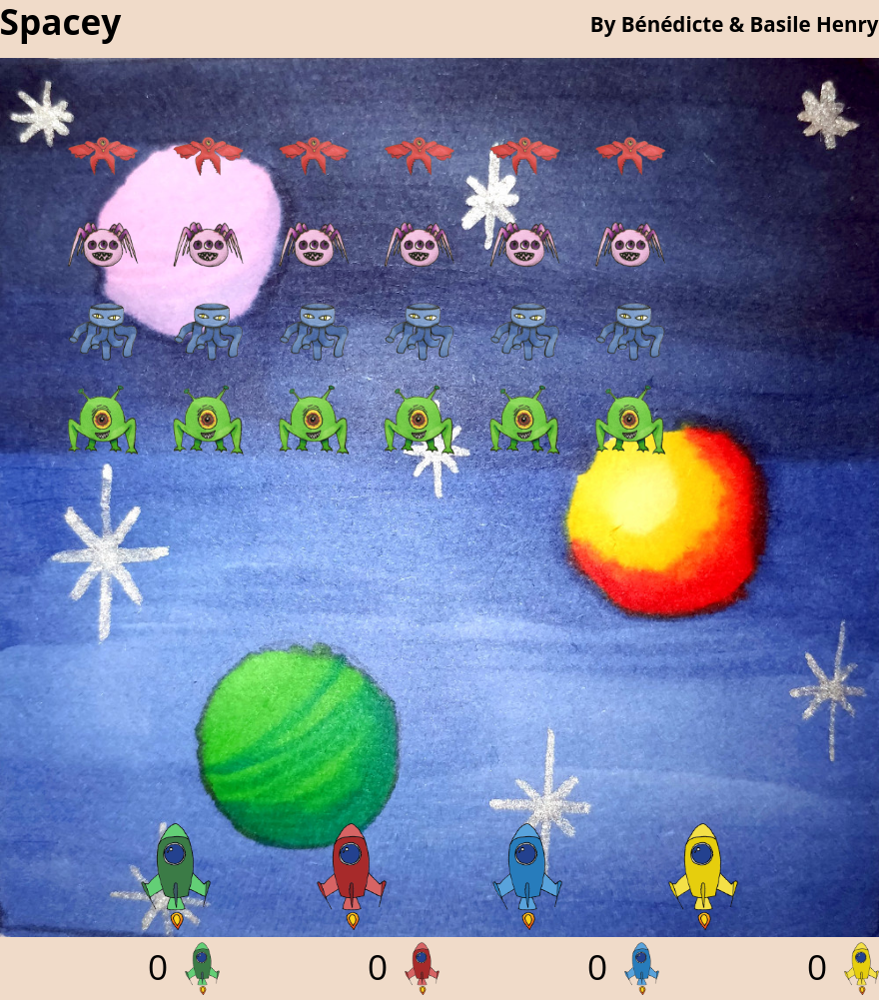

# Spacey

A small space-invaders clone with hand-drawn graphics.



# Build and run

This requires nix:

```sh
$(nix-build -j auto --no-out-link)
```

This will run the server on port `1234`.

# License

Copyright (c) 2018 Bénédicte Henry & Basile Henry

## Code

All the code is under the [MIT license](LICENSE).

## Art

<a rel="license" href="http://creativecommons.org/licenses/by-nc-sa/4.0/"></a><br />The art (everything in `./client/res`) is licensed under a <a rel="license" href="http://creativecommons.org/licenses/by-nc-sa/4.0/">Creative Commons Attribution-NonCommercial-ShareAlike 4.0 International License</a>.
